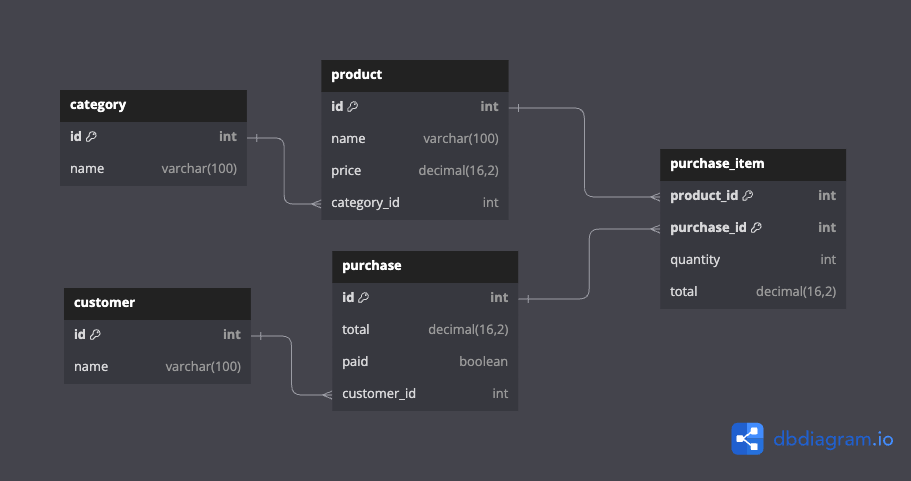

# Java Spring Market

This is a simple web API for a market application. It uses Spring Boot, Spring Data JPA, and connects to a PostgreSQL database. It implements Repository and Data Mapper patterns.

## PGAdmin

For use PGAdmin, you need to run the following command in the root directory of the project:

```bash
docker-compose up -d
```

Then, you can access to PGAdmin in <http://localhost> and login with the credentials specified in `docker-compose.yml` file.

For stop PGAdmin, you need to run the following command:

```bash
docker-compose down
```

## Entity-Relationship Diagram

The following diagram shows the entity-relationship model of the application:



## Frontend Repository

<https://github.com/jpin730/angular-spring-market>
